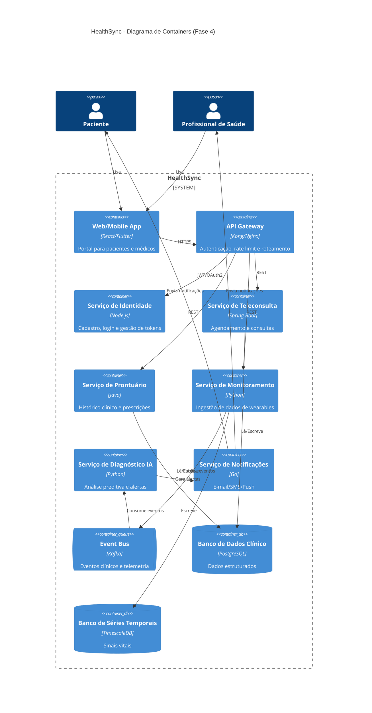

# HealthSync - Plataforma de Telemedicina Inteligente

## Visão executiva
A HealthSync é uma plataforma de telemedicina que integra consultas remotas, monitorização contínua via dispositivos wearables e diagnóstico auxiliado por Inteligência Artificial. O sistema resolve a fragmentação do cuidado médico ao oferecer um ecossistema centralizado para pacientes e profissionais de saúde, com disponibilidade 24/7 e proteção rigorosa de dados clínicos.

## Estado atual (Fase 4)
A Fase 4 consolida a arquitetura alvo em nuvem e microsserviços, com foco em escalabilidade horizontal, resiliência e interoperabilidade. Este repositório documenta as decisões arquiteturais, os padrões de comunicação e o desenho de implantação em cloud.

## Documentação principal
- [SAD – Fase 3 (Arquitetura Fase 4)](docs/sad/sad-fase3.md)
- ADRs obrigatórios:
  - [ADR 0001 – Estratégia de Nuvem e Escalabilidade](docs/adrs/0001-estrategia-nuvem.md)
  - [ADR 0002 – Padrões de Resiliência](docs/adrs/0002-padrao-resiliencia.md)
  - [ADR 0003 – Modelo de Comunicação](docs/adrs/0003-modelo-comunicacao.md)

## Diagrama C4 de Containers (Mermaid)


## Principais decisões arquiteturais
- Arquitetura hexagonal no core de domínio e microsserviços para isolamento de responsabilidade.
- Estratégia de nuvem baseada em PaaS com Kubernetes gerenciado e bancos de dados gerenciados.
- Resiliência com API Gateway, circuit breaker, retries exponenciais e isolamento por bulkheads.
- Comunicação híbrida: síncrona para interações clínicas e assíncrona para telemetria e alertas.

## Como executar localmente
1. Clone o repositório:
   ```bash
   git clone https://github.com/Raik22/Mini-Projeto-HealthSync---Plataforma-de-Telemedicina-Inteligente-
   cd Mini-Projeto-HealthSync---Plataforma-de-Telemedicina-Inteligente-
   ```
2. Este repositório é focado em documentação. Para leitura local, abra os arquivos `.md` no editor de sua preferência ou sirva a pasta via HTTP:
   ```bash
   python -m http.server 8000
   ```
3. A implementação dos serviços será adicionada em `src/` na evolução do projeto.

## Estrutura do repositório
```
📦 Mini-Projeto-HealthSync---Plataforma-de-Telemedicina-Inteligente-
 ┣ 📂 src
 ┣ 📂 docs
 ┃ ┣ 📂 adrs
 ┃ ┣ 📂 sad
 ┃ ┗ 📂 diagrams
 ┣ 📂 gold-plating
 ┣ 📜 README.md
 ┗ 📜 .gitignore
```
