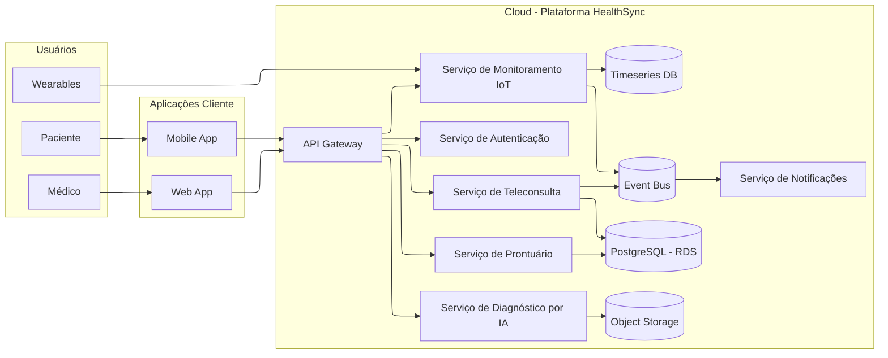

# HealthSync - Plataforma de Telemedicina Inteligente

## Visão executiva do sistema
A HealthSync é uma plataforma de telemedicina que integra consultas remotas, monitorização contínua via dispositivos wearables e diagnóstico assistido por IA. O sistema resolve a fragmentação do cuidado médico ao centralizar atendimento, prontuário e sinais vitais, garantindo disponibilidade, segurança e interoperabilidade.

**Estado atual (Fase 4):** a arquitetura foi evoluída para um modelo cloud-native em microsserviços, com observabilidade, escalabilidade horizontal e resiliência aplicada nos pontos críticos de comunicação e persistência.

## Diagrama C4 de Containers (Mermaid)


## ADRs (Decisões Arquiteturais)
- [ADR 0001 — Estratégia de Nuvem e Escalabilidade](docs/adrs/0001-estrategia-nuvem.md)
- [ADR 0002 — Padrões de Resiliência](docs/adrs/0002-padrao-resiliencia.md)
- [ADR 0003 — Modelo de Comunicação](docs/adrs/0003-modelo-comunicacao.md)

## SAD (Fase 4)
- [SAD Fase 3 - Arquitetura Cloud/Microsserviços](docs/sad/sad-fase3.md)

## Como executar o projeto localmente
Este repositório é focado em documentação arquitetural. A implementação dos serviços está prevista para a pasta `/src`.

1. Clone o repositório:
   ```bash
   git clone https://github.com/Raik22/Mini-Projeto-HealthSync---Plataforma-de-Telemedicina-Inteligente-.git
   ```
2. Acesse a pasta do projeto:
   ```bash
   cd Mini-Projeto-HealthSync---Plataforma-de-Telemedicina-Inteligente-
   ```
3. Abra o README e os artefatos em `/docs` para leitura e revisão.
4. Quando os serviços estiverem implementados em `/src`, execute-os localmente via Docker Compose conforme instruções específicas dessa pasta.
