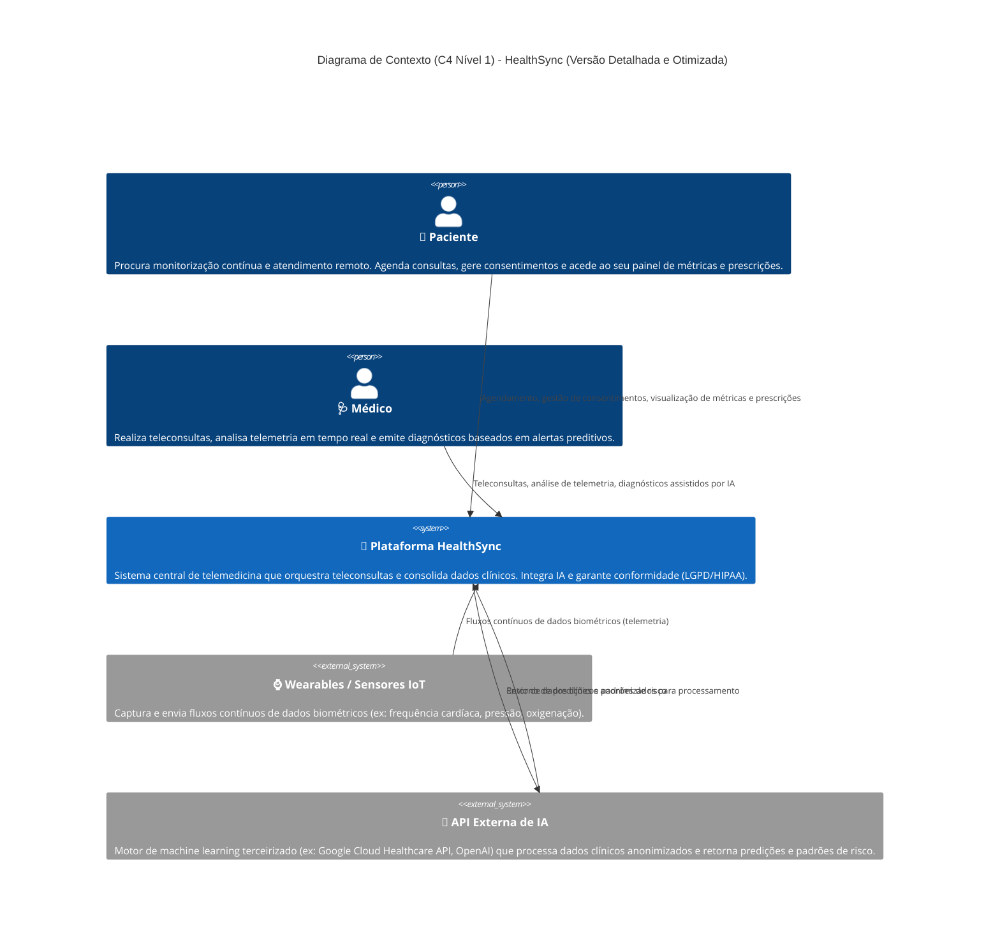

# 1.3 Diagrama de Contexto (C4 Nível 1)

```mermaid
---
config:
  layout: elk
---
C4Context
  title Diagrama de Contexto (C4 Nível 1) - HealthSync (Versão Detalhada e Otimizada)
  
  Person(patient, "👤 Paciente", "Procura monitorização contínua e atendimento remoto. Agenda consultas, gere consentimentos e acede ao seu painel de métricas e prescrições.")
  
  Person(doctor, "🩺 Médico", "Realiza teleconsultas, analisa telemetria em tempo real e emite diagnósticos baseados em alertas preditivos.")
  
  System(healthsync, "🧩 Plataforma HealthSync", "Sistema central de telemedicina que orquestra teleconsultas e consolida dados clínicos. Integra IA e garante conformidade (LGPD/HIPAA).")
  
  System_Ext(wearables, "⌚ Wearables / Sensores IoT", "Captura e envia fluxos contínuos de dados biométricos (ex: frequência cardíaca, pressão, oxigenação).")
  
  System_Ext(aiapi, "🤖 API Externa de IA", "Motor de machine learning terceirizado (ex: Google Cloud Healthcare API, OpenAI) que processa dados clínicos anonimizados e retorna predições e padrões de risco.")
  
  Rel(patient, healthsync, "Agendamento, gestão de consentimentos, visualização de métricas e prescrições")
  Rel(doctor, healthsync, "Teleconsultas, análise de telemetria, diagnósticos assistidos por IA")
  Rel(wearables, healthsync, "Fluxos contínuos de dados biométricos (telemetria)")
  Rel(healthsync, aiapi, "Envio de dados clínicos anonimizados para processamento")
  Rel(aiapi, healthsync, "Retorno de predições e padrões de risco")
```
