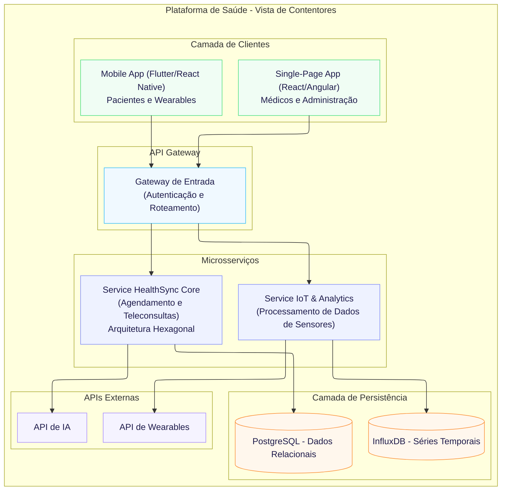

# 2.1 Diagrama de Containers (C4 Nível 2)

```mermaid
---
config:
  layout: elk
---
flowchart TB
  subgraph g0[Plataforma de Saúde - Vista de Contentores]
    subgraph Clients["Camada de Clientes"]
      SPA["Single-Page App (React/Angular)\nMédicos e Administração"]
      Mobile["Mobile App (Flutter/React Native)\nPacientes e Wearables"]
    end

    subgraph API["API Gateway"]
      Gateway["Gateway de Entrada\n(Autenticação e Roteamento)"]
    end

    subgraph Services["Microsserviços"]
      Core["Service HealthSync Core\n(Agendamento e Teleconsultas)\nArquitetura Hexagonal"]
      IoT["Service IoT & Analytics\n(Processamento de Dados de Sensores)"]
    end

    subgraph Databases["Camada de Persistência"]
      SQL[(PostgreSQL - Dados Relacionais)]
      TSDB[(InfluxDB - Séries Temporais)]
    end

    subgraph External["APIs Externas"]
      AI[API de IA]
      Wearables[API de Wearables]
    end
  end

  SPA --> Gateway
  Mobile --> Gateway
  Gateway --> Core
  Gateway --> IoT

  Core --> SQL
  IoT --> TSDB

  Core --> AI
  IoT --> Wearables

  classDef client stroke:#4ade80,fill:#f0fdf4,color:#1e1b4b
  classDef gateway stroke:#38bdf8,fill:#f0f9ff,color:#1e1b4b
  classDef service stroke:#818cf8,fill:#eef2ff,color:#1e1b4b
  classDef db stroke:#fb923c,fill:#fff7ed,color:#1e1b4b
  classDef external stroke:#a78bfa,fill:#f5f3ff,color:#1e1b4b

  class SPA,Mobile client
  class Gateway gateway
  class Core,IoT service
  class SQL,TSDB db
  class AI,Wearables external
```
