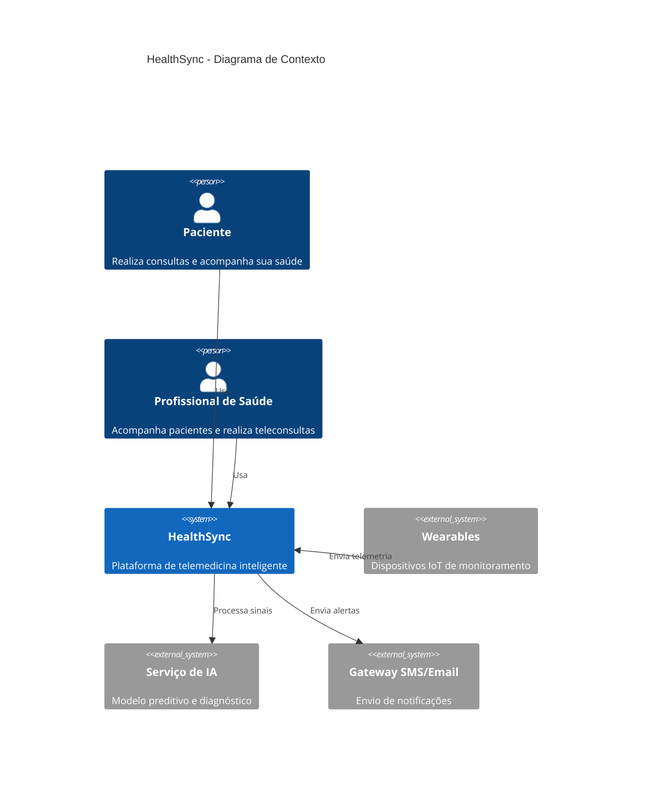

# Diagrama de Contexto (C4 - Nível 1)

```mermaid
C4Context
title HealthSync - Diagrama de Contexto

Person(patient, "Paciente", "Realiza consultas e acompanha sua saúde")
Person(doctor, "Profissional de Saúde", "Acompanha pacientes e realiza teleconsultas")
System(healthsync, "HealthSync", "Plataforma de telemedicina inteligente")
System_Ext(wearables, "Wearables", "Dispositivos IoT de monitoramento")
System_Ext(ai_provider, "Serviço de IA", "Modelo preditivo e diagnóstico")
System_Ext(sms, "Gateway SMS/Email", "Envio de notificações")

Rel(patient, healthsync, "Usa")
Rel(doctor, healthsync, "Usa")
Rel(wearables, healthsync, "Envia telemetria")
Rel(healthsync, ai_provider, "Processa sinais")
Rel(healthsync, sms, "Envia alertas")
```
