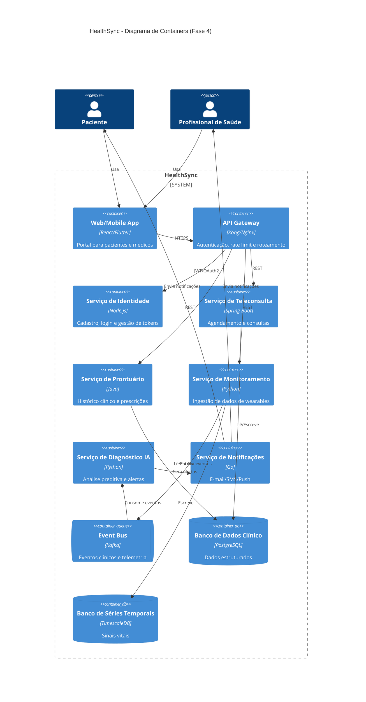

# Diagrama de Containers (C4 - Nível 2)

```mermaid
C4Container
title HealthSync - Diagrama de Containers (Fase 4)

Person(patient, "Paciente")
Person(doctor, "Profissional de Saúde")
System_Boundary(hs, "HealthSync") {
  Container(web, "Web/Mobile App", "React/Flutter", "Portal para pacientes e médicos")
  Container(api, "API Gateway", "Kong/Nginx", "Autenticação, rate limit e roteamento")
  Container(auth, "Serviço de Identidade", "Node.js", "Cadastro, login e gestão de tokens")
  Container(telemed, "Serviço de Teleconsulta", "Spring Boot", "Agendamento e consultas")
  Container(prontuario, "Serviço de Prontuário", "Java", "Histórico clínico e prescrições")
  Container(iot, "Serviço de Monitoramento", "Python", "Ingestão de dados de wearables")
  Container(ai, "Serviço de Diagnóstico IA", "Python", "Análise preditiva e alertas")
  Container(notification, "Serviço de Notificações", "Go", "E-mail/SMS/Push")
  ContainerQueue(bus, "Event Bus", "Kafka", "Eventos clínicos e telemetria")
  ContainerDb(db, "Banco de Dados Clínico", "PostgreSQL", "Dados estruturados")
  ContainerDb(timeseries, "Banco de Séries Temporais", "TimescaleDB", "Sinais vitais")
}

Rel(patient, web, "Usa")
Rel(doctor, web, "Usa")
Rel(web, api, "HTTPS")
Rel(api, auth, "JWT/OAuth2")
Rel(api, telemed, "REST")
Rel(api, prontuario, "REST")
Rel(api, iot, "REST")
Rel(iot, bus, "Publica eventos")
Rel(bus, ai, "Consome eventos")
Rel(ai, notification, "Gera alertas")
Rel(prontuario, db, "Lê/Escreve")
Rel(telemed, db, "Lê/Escreve")
Rel(iot, timeseries, "Escreve")
Rel(notification, patient, "Envia notificações")
Rel(notification, doctor, "Envia notificações")
```
